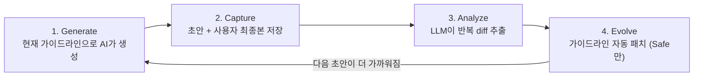

<div align="center">

# Self-Tuning Loop

**당신의 편집을 학습하는 AI 드래프트 — Fine-tuning, GPU, 라벨 데이터 모두 불필요.**

AI가 만든 초안을 편집할 때마다 발생하는 diff는 암묵적 피드백 신호입니다. 대부분의 팀은 이 신호를 버립니다.
Self-Tuning Loop은 이 diff를 캡처하고, 반복되는 패턴을 찾아 프롬프트 가이드라인을 자동으로 갱신합니다. 다음 초안은 원하는 결과에 더 가까워진 상태로 출발합니다.

[](./LICENSE)
[](#로드맵)
[](./tsconfig.json)
[](https://supabase.com)
[](#기여)

[🇺🇸 English](./README.md) · **한국어**

</div>

## 버려지는 학습 신호

AI 출력을 편집할 때마다 학습 신호가 생깁니다 — AI가 쓴 것과 실제로 원했던 것 사이의 diff. 대부분의 팀이 이걸 버립니다.

| 지금 일어나는 일 | 비용 |
|---|---|
| 10개 중 8개 초안에서 같은 인트로 패턴을 수정 | 11번째 초안도 같은 잘못된 인트로 |
| 마케팅이 "Best regards"를 매번 "— Best,"로 다시 씀 | 모델은 학습하지 않음 |
| 엔지니어링이 코드 리뷰 요약을 매번 손봄 | 다음 스프린트에 같은 잔실수 |
| Fine-tuning 검토 | 가격, GPU, 라벨링 — 2주차에 포기 |

**피드백이 부족한 게 아니라, 매번 버리고 있는 겁니다.**

## 30초 데모

```bash
git clone https://github.com/minjikim89/self-tuning-loop
cd self-tuning-loop
./setup.sh                       # 4단계 인터랙티브 설정
```

편집을 캡처:

```typescript
import { storeDraft, captureFinal } from './src/capture.js';

const draftId = await storeDraft('email', '클라이언트 회신', aiText);
// ...사용자가 초안을 편집한 뒤 발송...
await captureFinal({ draftId, humanFinal: editedText });
```

주간 실행:

```bash
npm run analyze -- email 7        # 최근 7일 패턴 추출
npm run evolve  -- email           # Safe 패턴을 가이드라인에 적용
npm run score   -- email           # 버전별 개선도 확인
```

```text
=== Quality Scores: email ===

Version | Avg Rating | Drafts | Source       | Created
--------|------------|--------|-------------|--------
v1      | 3.2/5      | 8      | manual      | 2026-04-01
v2      | 3.8/5      | 12     | auto_evolve | 2026-04-08
v3      | 4.3/5      | 6      | auto_evolve | 2026-04-15

Trend: v1 (3.2) → v3 (4.3) ↑ +1.1
```

## 동작 방식



| 단계 | 트리거 | 컴포넌트 | 하는 일 |
|---|---|---|---|
| **Generate** | 사용자 앱 | 사용자 코드 + LLM | `guidelines/{domain}` 최신 버전으로 초안 생성 |
| **Capture** | 사용자 편집 | `capture.ts` | 두 버전 저장, diff 요약 |
| **Analyze** | 주간 (사용자 스케줄러) | `analyze.ts` | LLM이 3회 이상 반복 패턴 추출 |
| **Evolve** | analyze 직후 | `evolve.ts` | Safe 패턴을 새 버전 가이드라인에 추가 |
| **Score** | 수동 실행 | `score.ts` | 버전별 평균 피드백 평점 비교 |

## Fine-tuning, DSPy, TextGrad, OPRO 대신 이걸 쓰는 이유

학계는 자동 프롬프트 최적화 (Automatic Prompt Optimization)를 다양하게 탐구해왔지만, **인간 편집 diff를 학습 신호로 쓰는 방식은 Self-Tuning Loop이 유일합니다.**

|  | Fine-tuning | DSPy | TextGrad | OPRO | **Self-Tuning Loop** |
|---|---|---|---|---|---|
| **비용** | $$$ GPU | $ LLM 호출 | $$ LLM 호출 | $ LLM 호출 | **$ LLM 호출** |
| **필요 데이터** | 수백 개 라벨 페어 | 예시 + metric 함수 | Differentiable signal | Score 함수 | **3개 diff부터 시작** |
| **암묵적 피드백 (편집 활용)** | ❌ | ❌ | ❌ | ❌ | **✅** |
| **출력 형식** | 블랙박스 weights | Compiled program | Gradient text | Search trace | **사람이 읽는 마크다운** |
| **롤백** | 체크포인트 복구 | 재컴파일 | 재실행 | 재실행 | **한 줄 삭제** |
| **Model-locked** | 예 | 아니오 | 아니오 | 아니오 | **아니오** |
| **감사 가능성** | 불가 | 부분적 | 부분적 | 부분적 | **`git diff`로 가능** |

**트레이드오프**: Self-Tuning Loop은 어려운 추론 (Reasoning) 과제에서는 fine-tuning을 못 이깁니다. 톤, 포맷, 구조적 컨벤션 — **출력 스타일이 목표**일 때 진가를 발휘합니다.

## 빠른 시작

### 사전 요구사항
- Node.js 22+
- Supabase 프로젝트 ([무료 티어 가능](https://supabase.com/dashboard))
- Anthropic API 키

### 설치
```bash
./setup.sh
```

스크립트가 하는 일:
1. 의존성 설치
2. `.env` 생성 (mode 600, 키 입력 마스킹 처리)
3. 테이블 생성 가이드 (`supabase/migrations/001_init.sql`을 SQL 에디터에 붙여넣거나 `supabase db push` 실행)
4. 예시 이메일 가이드라인 시드 데이터 삽입

### 환경 설정

| 환경 변수 | 기본값 | 용도 |
|---|---|---|
| `SUPABASE_URL` | — | 필수 |
| `SUPABASE_SERVICE_KEY` | — | 필수 (RLS bypass) |
| `ANTHROPIC_API_KEY` | — | 필수 |
| `ANTHROPIC_MODEL` | `claude-sonnet-4-6` | 다른 Claude 모델 사용 시 오버라이드 |
| `ANTHROPIC_MAX_TOKENS` | `8192` | 가이드라인이 길 때 상향. 절단 시 `LLMTruncatedError` throw — 절대 불완전한 가이드라인을 silent 저장하지 않음 |

## Safe vs Risky 패턴

모든 패턴이 자동 적용되어선 안 됩니다. `prompts/analyze-diffs.md`의 분류기가 결정:

| 분류 | 기준 | 동작 |
|---|---|---|
| **Safe** | 빈도 ≥70% AND 톤/스타일/포맷 | `evolve`가 자동 적용 |
| **Risky** | 빈도 <70% OR 구조/내용 변경 | 제안만 — 분석 결과에 표시되지만 기록되지 않음 |

이게 "자기개선"과 "자기파괴"를 가르는 안전장치입니다. `prompts/analyze-diffs.md`에서 튜닝 가능.

## 예시 가이드라인

```text
guidelines/
├── example-email.md        # 비즈니스 캐주얼, 3-5문장
├── example-blog.md         # 대화체, 1,500-3,000자
└── example-linkedin.md     # Hook 우선, 800-1,500자
```

복붙 가능한 템플릿. 도메인 (`domain`) 이름만 바꿔서 바로 사용.

## 아키텍처

```text
self-tuning-loop/
├── supabase/migrations/001_init.sql   # 3개 테이블: drafts, analysis_runs, guidelines
├── src/
│   ├── capture.ts                     # storeDraft() + captureFinal()
│   ├── analyze.ts                     # 주간 패턴 추출
│   ├── evolve.ts                      # Safe-only 자동 패치
│   ├── score.ts                       # 버전별 품질 추세
│   ├── llm.ts                         # 프로바이더 추상화 (LLMTruncatedError)
│   └── supabase.ts                    # service-role 클라이언트
└── prompts/
    ├── analyze-diffs.md               # Safe/Risky 분류기 튜닝
    └── evolve-guidelines.md
```

## 적합한 사용자

| 당신이... | Self-Tuning Loop이 도와주는 것 |
|---|---|
| **AI 기능을 빠르게 출시하는 1인 창업자** | 매 릴리스마다 손으로 프롬프트 튜닝하는 일 그만두기 |
| **하우스 스타일을 가진 콘텐츠 팀** | 에디터 선호도를 프롬프트에 자동 인코딩 |
| **코드 리뷰 템플릿이 있는 엔지니어링 팀** | 리뷰어가 매번 지적하지만 명문화 안 된 패턴 자동 캡처 |
| **HITL 프롬프트 최적화를 연구하는 리서처** | Diff-as-feedback의 레퍼런스 구현 |

## 로드맵

- **v0.1** ✅ 레퍼런스 구현 (현재 버전)
- **v0.2** 멀티테넌트 (`user_id` 컬럼 + RLS 정책)
- **v0.3** MCP 서버 — Claude Code, Cursor, 모든 MCP 호스트에서 즉시 사용
- **v0.4** Pluggable storage (Postgres/SQLite/edge KV), pluggable LLM (OpenAI/Gemini)
- **v1.0** 프로덕션급: 재시도, observability, 스키마 검증, 전체 테스트 커버리지

[이슈 등록](https://github.com/minjikim89/self-tuning-loop/issues) — 다음 우선순위 투표.

## 기여

이슈와 PR 환영. 큰 변경은 먼저 이슈로 접근 방식을 논의해주세요.

로컬 개발:
```bash
npm install
npx tsc --noEmit          # 타입 체크
npm run analyze -- email 7 --dry-run
```

## 배경

이 패턴은 뉴스 큐레이션, LinkedIn 초안 작성, 블로그 생성 — 모두 자기개선 피드백 루프 (Self-improving Feedback Loop)로 동작하는 개인 자동화 시스템 운영 중에 도출되었습니다. 학계 (DSPy, TextGrad, OPRO, POHF)는 자동 프롬프트 최적화를 다양하게 탐구해왔지만, **인간 편집 diff를 암묵적 피드백으로 활용하는 방식은 없었습니다.** 이 프로젝트가 그 빈 자리입니다.

전체 시리즈:
- [Part 1: 버려지는 신호](https://minbook.dev/ko/blog/self-tuning-loop-wasted-signal)
- [Part 2: 시스템 해부](https://minbook.dev/ko/blog/self-tuning-loop-system-anatomy)
- [Part 3: 직접 만들기](https://minbook.dev/ko/blog/self-tuning-loop-build-your-own)

## 라이선스

MIT. [LICENSE](./LICENSE) 참조.
