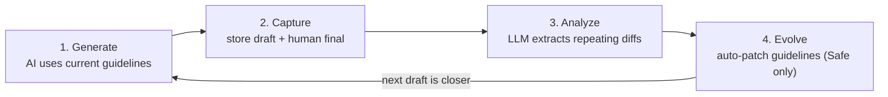

<div align="center">

# Self-Tuning Loop

**AI drafts that learn from your edits — no fine-tuning, no GPU, no labeled data.**

Every edit you make to an AI-generated draft is implicit feedback.
Self-Tuning Loop captures the diff, finds repeating patterns, and rewrites your prompt guidelines automatically. Your next draft starts closer to what you actually wanted.

[](./LICENSE)
[](#roadmap)
[](./tsconfig.json)
[](https://supabase.com)
[](#contributing)

**English** · [🇰🇷 한국어](./README.ko.md)

</div>

## The Wasted Signal

Every time you edit AI output, you produce a learning signal — the diff between what AI wrote and what you actually wanted. Most teams throw it away.

| What happens today | What it costs you |
|---|---|
| You fix the same intro pattern in 8 of 10 drafts | The 11th draft has the same wrong intro |
| Marketing rewrites every "Best regards" to "— Best," | The model never learns |
| Engineering tweaks every code review summary | Same nits next sprint |
| You consider fine-tuning | Pricing, GPU, label workflow — abandoned in week two |

**You're not running out of feedback. You're throwing it out.**

## 30-Second Demo

```bash
git clone https://github.com/minjikim89/self-tuning-loop
cd self-tuning-loop
./setup.sh                       # 4-step interactive setup
```

Capture an edit:

```typescript
import { storeDraft, captureFinal } from './src/capture.js';

const draftId = await storeDraft('email', 'Reply to client', aiText);
// ...user edits the draft and hits send...
await captureFinal({ draftId, humanFinal: editedText });
```

Run weekly:

```bash
npm run analyze -- email 7        # extract patterns from last 7 days
npm run evolve  -- email           # apply Safe patterns to guidelines
npm run score   -- email           # show improvement over versions
```

```text
=== Quality Scores: email ===

Version | Avg Rating | Drafts | Source       | Created
--------|------------|--------|-------------|--------
v1      | 3.2/5      | 8      | manual      | 2026-04-01
v2      | 3.8/5      | 12     | auto_evolve | 2026-04-08
v3      | 4.3/5      | 6      | auto_evolve | 2026-04-15

Trend: v1 (3.2) → v3 (4.3) ↑ +1.1
```

## How It Works



| Step | Trigger | Component | What it does |
|------|---------|-----------|--------------|
| **Generate** | Your app | Your code + LLM | Generate a draft using `guidelines/{domain}` v_latest |
| **Capture** | User edits | `capture.ts` | Store both versions, summarize the diff |
| **Analyze** | Weekly (your scheduler) | `analyze.ts` | LLM finds patterns repeating 3+ times |
| **Evolve** | After analyze | `evolve.ts` | Append Safe patterns to a new guideline version |
| **Score** | On demand | `score.ts` | Compare avg feedback rating per version |

## Why Not Fine-Tuning, DSPy, TextGrad, OPRO?

The academic landscape has explored automatic prompt optimization. Self-Tuning Loop is **the only one that uses human edit diffs as its training signal.**

|  | Fine-tuning | DSPy | TextGrad | OPRO | **Self-Tuning Loop** |
|---|---|---|---|---|---|
| **Cost** | $$$ GPU | $ LLM calls | $$ LLM calls | $ LLM calls | **$ LLM calls** |
| **Data required** | 100s of labeled pairs | Examples + metric fn | Differentiable signal | Score function | **3+ diffs to start** |
| **Implicit feedback (edits)** | ❌ | ❌ | ❌ | ❌ | **✅** |
| **Output format** | Black-box weights | Compiled program | Gradient text | Search trace | **Human-readable markdown** |
| **Rollback** | Restore checkpoint | Recompile | Re-run | Re-run | **Delete one line** |
| **Model-locked** | Yes | No | No | No | **No** |
| **Auditable** | No | Partial | Partial | Partial | **Yes — `git diff`** |

**Trade-off**: Self-Tuning Loop won't beat fine-tuning on hard reasoning tasks. It excels where output style is the goal: tone, formatting, structural conventions.

## Quick Start

### Prerequisites
- Node.js 22+
- Supabase project ([free tier works](https://supabase.com/dashboard))
- Anthropic API key

### Setup
```bash
./setup.sh
```

The script:
1. Installs dependencies
2. Creates `.env` (mode 600, key input masked)
3. Guides you through table creation (paste `supabase/migrations/001_init.sql` into the SQL editor or run `supabase db push`)
4. Seeds an example email guideline

### Configuration

| Env var | Default | Purpose |
|---|---|---|
| `SUPABASE_URL` | — | Required |
| `SUPABASE_SERVICE_KEY` | — | Required (RLS bypass) |
| `ANTHROPIC_API_KEY` | — | Required |
| `ANTHROPIC_MODEL` | `claude-sonnet-4-6` | Override to use any Claude model |
| `ANTHROPIC_MAX_TOKENS` | `8192` | Raised when guideline outputs are large; truncation throws `LLMTruncatedError` (never silently saves a partial guideline) |

## Safe vs Risky Patterns

Not every pattern should auto-apply. The classifier in `prompts/analyze-diffs.md` decides:

| Class | Criteria | Action |
|---|---|---|
| **Safe** | ≥70% frequency AND tone/style/format | Auto-applied by `evolve` |
| **Risky** | <70% frequency OR structural/content change | Suggested only — surfaces in analysis run, never written |

This is the guardrail that separates "self-improving" from "self-corrupting." Tune it in `prompts/analyze-diffs.md`.

## Examples

```text
guidelines/
├── example-email.md        # Business casual, 3-5 sentences
├── example-blog.md         # Conversational, 1.5-3k words
└── example-linkedin.md     # Hook-first, 800-1500 chars
```

Drop-in templates. Edit, change `domain`, run.

## Architecture

```text
self-tuning-loop/
├── supabase/migrations/001_init.sql   # 3 tables: drafts, analysis_runs, guidelines
├── src/
│   ├── capture.ts                     # storeDraft() + captureFinal()
│   ├── analyze.ts                     # weekly pattern extraction
│   ├── evolve.ts                      # Safe-only auto-patch
│   ├── score.ts                       # quality trend across versions
│   ├── llm.ts                         # provider abstraction (LLMTruncatedError)
│   └── supabase.ts                    # service-role client
└── prompts/
    ├── analyze-diffs.md               # tune the Safe/Risky classifier here
    └── evolve-guidelines.md
```

## Who This Is For

| You are... | Self-Tuning Loop helps you... |
|---|---|
| **A solo founder shipping AI features** | Stop hand-tuning prompts after every release |
| **A content team with house style** | Encode editor preferences into the prompt automatically |
| **An engineering team with code review templates** | Capture the patterns reviewers ask for, but never wrote down |
| **A researcher exploring HITL prompt optimization** | Reference implementation for diff-as-feedback |

## Roadmap

- **v0.1** ✅ Reference implementation (this release)
- **v0.2** Multi-tenant (`user_id` column + RLS policies)
- **v0.3** MCP server — drop-in for Claude Code, Cursor, any MCP host
- **v0.4** Pluggable storage (Postgres/SQLite/edge KV) and pluggable LLM (OpenAI/Gemini)
- **v1.0** Production-grade: retries, observability, schema validation, full test coverage

[Open an issue](https://github.com/minjikim89/self-tuning-loop/issues) to vote on what's next.

## Contributing

Issues and PRs welcome. For larger changes, please open an issue first to discuss the approach.

Local development:
```bash
npm install
npx tsc --noEmit          # type-check
npm run analyze -- email 7 --dry-run
```

## Background

This pattern emerged from operating a personal automation system that runs news curation, LinkedIn drafting, and blog generation — all with self-improving feedback loops. The academic landscape (DSPy, TextGrad, OPRO, POHF) has explored automatic prompt optimization, but none use **human edit diffs as implicit feedback.** This is that missing piece.

Read the full series:
- [Part 1: The Wasted Signal](https://minbook.dev/ko/blog/self-tuning-loop-wasted-signal)
- [Part 2: System Anatomy](https://minbook.dev/ko/blog/self-tuning-loop-system-anatomy)
- [Part 3: Build Your Own](https://minbook.dev/ko/blog/self-tuning-loop-build-your-own)

## License

MIT. See [LICENSE](./LICENSE).
