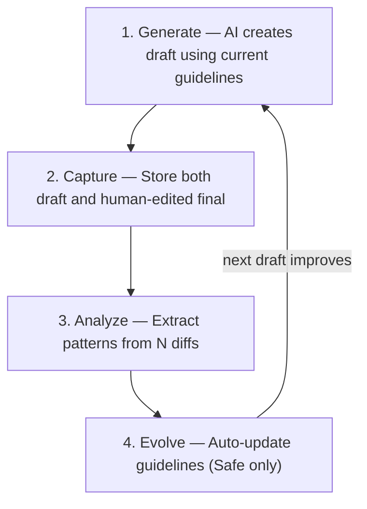

# Self-Tuning Loop

**AI drafts that learn from your edits.**

Every time you edit an AI-generated draft, you're producing a learning signal — the diff between what AI wrote and what you actually wanted. This signal is thrown away every single time.

Self-Tuning Loop captures these diffs, analyzes patterns, and automatically evolves your prompt guidelines. No fine-tuning, no ML infrastructure, no cost.

```
Generate → Capture → Analyze → Evolve → (better next draft)
```

## How It Works



| Step | What happens | Who does it |
|------|-------------|-------------|
| **Generate** | AI creates a draft following your guidelines | Your app + LLM |
| **Capture** | Draft + final version stored, diff summarized | `capture.ts` |
| **Analyze** | Weekly: LLM extracts repeating edit patterns | `analyze.ts` (cron) |
| **Evolve** | Safe patterns auto-added to guidelines | `evolve.ts` (cron) |

## Quick Start

```bash
git clone https://github.com/minjikim89/self-tuning-loop
cd self-tuning-loop
./setup.sh
```

The setup script will:
1. Install dependencies
2. Create `.env` with your Supabase + Anthropic keys
3. Guide you through table creation
4. Seed an example guideline

## Usage

### Store a draft
```typescript
import { storeDraft } from './src/capture.js';

const draftId = await storeDraft('email', 'Reply to client about timeline', aiGeneratedText);
```

### Capture the edit
```typescript
import { captureFinal } from './src/capture.js';

await captureFinal({ draftId, humanFinal: editedText });
```

### Run analysis (weekly)
```bash
npm run analyze -- email 7    # analyze 'email' domain, last 7 days
```

### Evolve guidelines (after analysis)
```bash
npm run evolve -- email --dry-run   # preview changes without applying
npm run evolve -- email              # apply Safe patterns
```

### Track quality over time
```bash
npm run score -- email
# Version | Avg Rating | Drafts | Source       | Created
# v1      | 3.2/5      | 8      | manual      | 2026-04-01
# v2      | 3.8/5      | 12     | auto_evolve | 2026-04-08
# v3      | 4.3/5      | 6      | auto_evolve | 2026-04-15
# Trend: v1 (3.2) → v3 (4.3) ↑ +1.1
```

## Project Structure

```
self-tuning-loop/
├── supabase/migrations/001_init.sql   # Database schema (3 tables)
├── src/
│   ├── capture.ts                     # Store drafts + capture edits
│   ├── analyze.ts                     # Extract patterns from diffs
│   ├── evolve.ts                      # Auto-patch guidelines (--dry-run supported)
│   ├── score.ts                       # Quality score tracking across versions
│   ├── llm.ts                         # LLM abstraction (swap for any provider)
│   └── supabase.ts                    # DB client
├── prompts/
│   ├── analyze-diffs.md               # Pattern extraction prompt
│   └── evolve-guidelines.md           # Guideline evolution prompt
├── guidelines/
│   ├── example-email.md               # Email guideline example
│   ├── example-blog.md                # Blog guideline example
│   └── example-linkedin.md            # LinkedIn guideline example
├── .github/workflows/
│   └── self-tune.yml                  # Weekly GitHub Actions workflow
└── setup.sh                           # One-command setup
```

## Safe vs Risky Changes

Not all patterns should be auto-applied. The system classifies each pattern:

| Classification | Criteria | Action |
|---------------|----------|--------|
| **Safe** | 70%+ frequency AND style/tone/format | Auto-applied |
| **Risky** | Below 70% OR structural changes | Suggested only |

This prevents the system from making destructive changes to your guidelines.

## Why Not Fine-Tuning?

| | Fine-tuning | Self-Tuning Loop |
|---|---|---|
| **Cost** | GPU hours + data pipeline | $0 |
| **Data needed** | Hundreds of pairs | As few as 3 diffs to start (configurable) |
| **Interpretability** | Black box | Human-readable guidelines |
| **Rollback** | Restore checkpoint | Delete one line |
| **Model-locked** | Yes | Works with any LLM |

## Background

This pattern emerged from operating a personal automation system that runs news curation, LinkedIn drafting, and blog generation — all with self-improving feedback loops. The academic landscape (DSPy, TextGrad, OPRO, POHF) has explored automatic prompt optimization, but none use **human edit diffs as implicit feedback**. This is that missing piece.

Read the full series:
- [Part 1: The Wasted Signal](https://minbook.dev/ko/blog/self-tuning-loop-wasted-signal)
- [Part 2: System Anatomy](https://minbook.dev/ko/blog/self-tuning-loop-system-anatomy)
- [Part 3: Build Your Own](https://minbook.dev/ko/blog/self-tuning-loop-build-your-own)

## License

MIT
